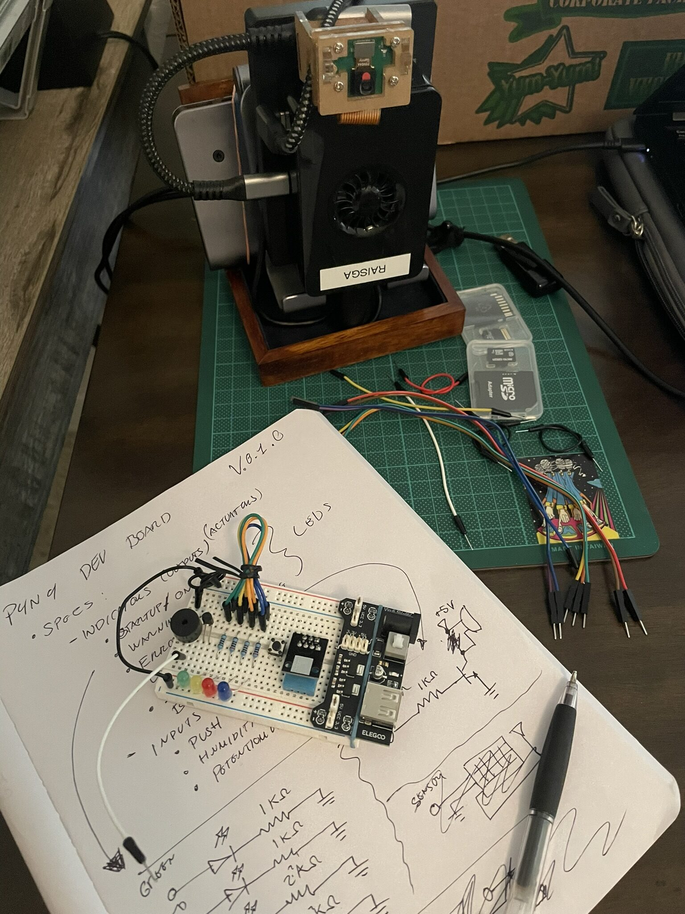
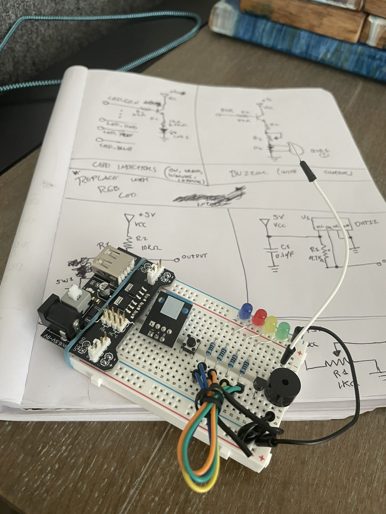
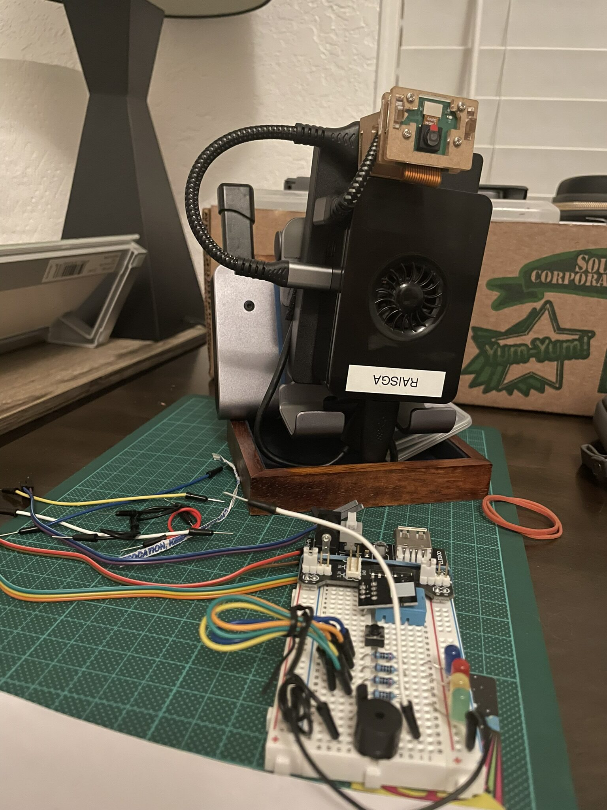

Hardware sorted. Time to actually write some config.

This session split into two areas: the software side, getting Docker running on the Pi and bringing up the MING stack for the first time... and the hardware side, designing and assembling the first GPIO test board. The board isn't connected to the Pi yet, but the pipeline is confirmed and ready, so the first real sensor data run is the obvious next step.

## Getting Docker on the Pi

Raspberry Pi OS Lite doesn't ship with Docker, but the official install script gets both Docker Engine and Compose v2 in one go. After adding the current user to the `docker` group and re-logging in, a quick `docker run hello-world` confirmed everything was working.

One thing worth noting on the Pi 5 running bookworm: cgroup v2 is enabled by default, and Docker handles it cleanly. No `/boot/cmdline.txt` edits, no kernel flags. Things have gotten a lot smoother since the Pi 4 days... hehe ;)

Compose ships as part of Docker Engine now, available as `docker compose`. This matters because the MING stack's `Makefile` calls it that throughout.

## Bringing Up the MING Stack for the First Time

With Docker running, the stack is a `git clone` and a `make up` away. The first run took a few minutes on the Pi while Docker pulled the four images... Mosquitto, InfluxDB, Node-RED, Grafana. Then services came up in dependency order: Mosquitto and InfluxDB first, Node-RED waits for both their healthchecks to pass, Grafana waits on InfluxDB. The compose file has proper healthchecks defined for every service, so nothing starts against a half-ready dependency. This is one of those small things that matters a lot at 2am when you're debugging something.

`make status` showed everything green. Grafana on port 3000, Node-RED on 1880, InfluxDB on 8086, all accessible from the laptop over SSH. MING was live... it's alive! :D

The `flows.json` pre-loaded in Node-RED was already wired: a single `MING IoT Pipeline` tab with `sensors/#` and `inference/#` subscriptions both routing into InfluxDB's `raw_telemetry` bucket, plus a `sandbox/#` path for dev use. No manual flow setup needed.

A `make test-mqtt` published a test temperature reading to `sensors/temperature`. Node-RED's debug panel showed it land. InfluxDB received the write. The pipeline worked on the first try, which felt great.

## Building the GPIO Test Board

Stack running, pipeline confirmed. Now for the part that makes this more than just a containerized demo: real sensor data from real hardware.

Before touching anything on the breadboard, the circuit got sketched out first.

The goal was straightforward: wire a humidity sensor to the Pi's GPIO header, read the value in Python, and publish it over MQTT to `sensors/humidity`. Have some LEDs in place to indicate the humidity or temperature levels. The brainstorming phase was mostly about pin assignments and whether a pull-up resistor was needed on the data line before committing anything to the board.

From rough sketch to an actual wiring diagram. Easy to skip this step when you just want to get something plugged in, but getting the layout on paper first makes the physical build faster and avoids rewiring mid-session.

With the design settled, the board came together quickly. Sensor to GPIO pins, power and ground in place, pull-up resistor on the data line. The test board is assembled and mostly ready... just not yet connected to the Raspberry Pi.

## What's Next

MING is up and the pipeline is confirmed with `make test-mqtt`. The GPIO test board is built. The next session is where these two things actually meet: connect the board to the Pi, read the humidity sensor over GPIO, and push the first real reading through MQTT into InfluxDB. The Node-RED flow is already subscribed to `sensors/#`, so the plumbing is there waiting.

After that, the `p4n4-hw` GPIO scripts are next in line, boot sequence indicators, service health monitoring via LED, the physical button handler. And the AI stack (`p4n4-ai`) is waiting too: Ollama, Letta, and n8n all joining the same `p4n4-net` bridge architecture.

Config written. Board built. Now to connect the two.
