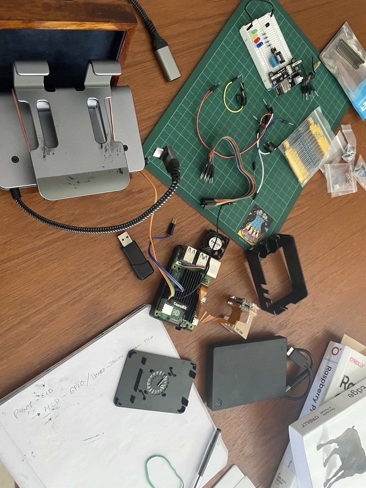
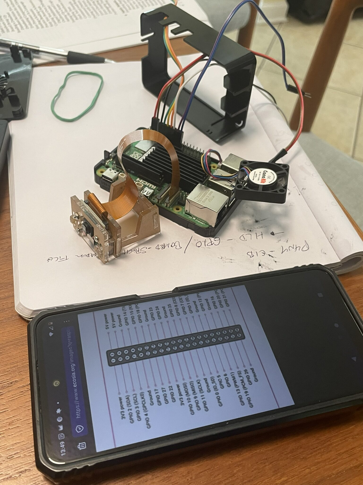
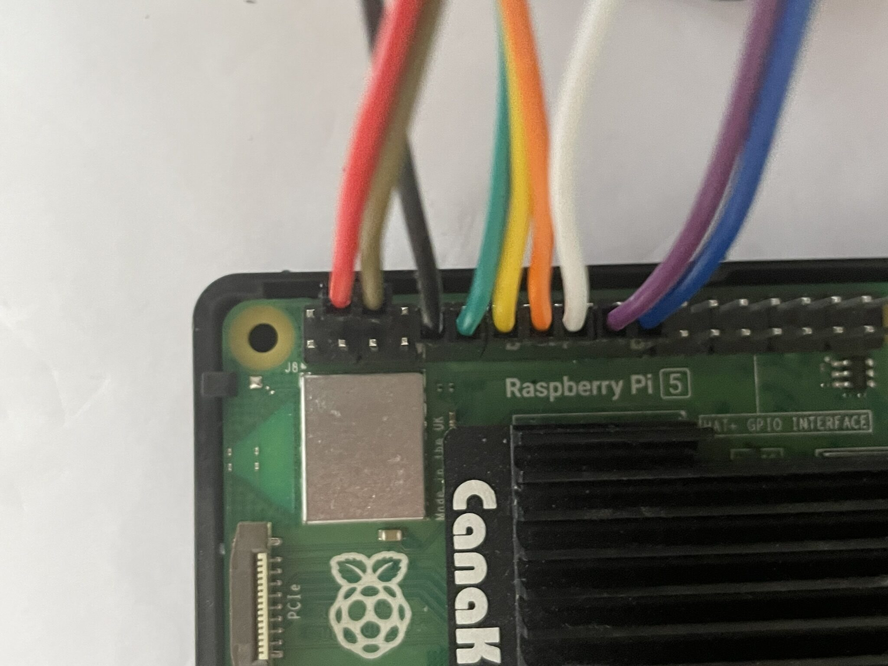
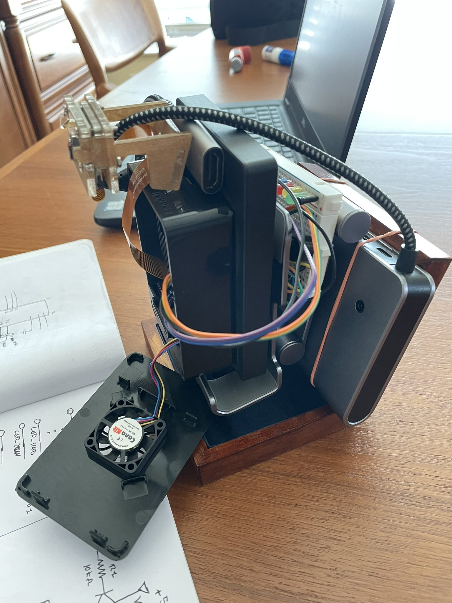
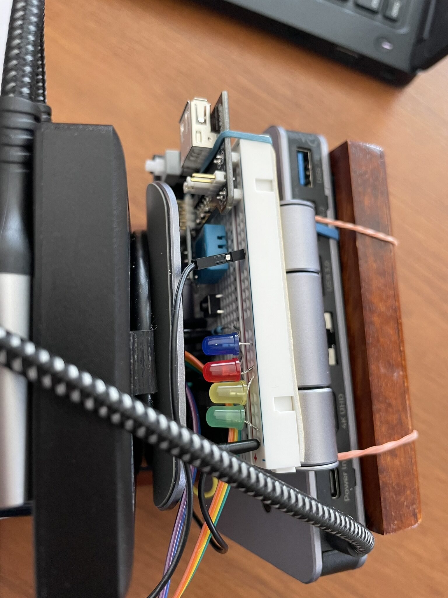
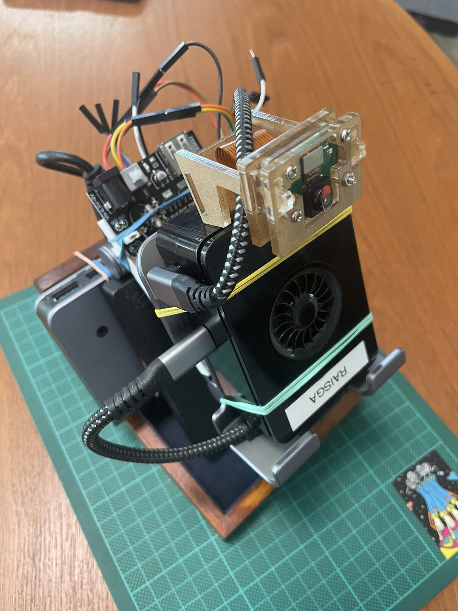
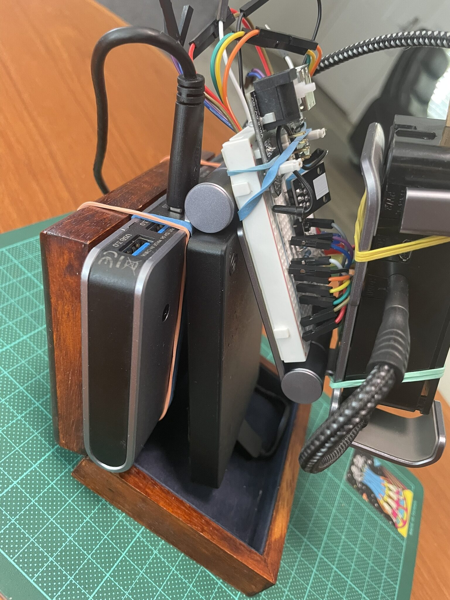
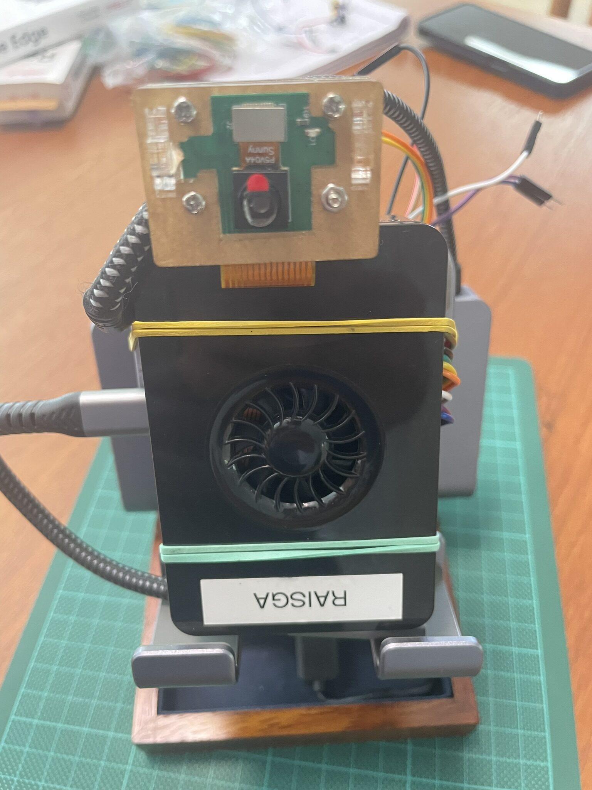
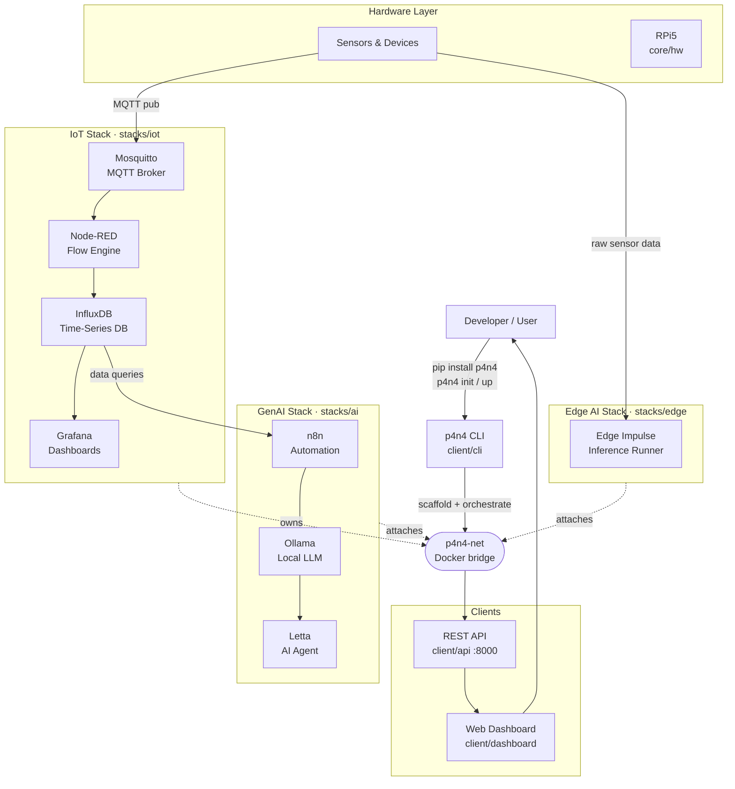

Board built. Stack running. Time to actually connect the two.

The previous session left the GPIO test board assembled but disconnected. This one was about closing that gap: ribbon cable to the Pi, power board in, demo breadboard hooked up, and the first real sensor readings flowing through MQTT into InfluxDB.

## Initial Work

Before plugging anything in, a quick look at the current state of things.

The board was in good shape from last time. The plan for this session was straightforward: wire the GPIO breakout, power it up through the USB board, and confirm the humidity sensor and LEDs were all reading correctly through the Pi.

## Connecting the Ribbon Cable to GPIO

The Pi 5's 40-pin GPIO header is compact, so a T-type GPIO breakout board and ribbon cable were used to bring the pins out to a cleaner, label-friendly layout. The ribbon cable locks into the Pi's header on one end and the breakout board on the other.

Getting the orientation right on the ribbon cable is the one step that matters here. The red stripe goes to pin 1. Reversed, you get nothing at best and a damaged peripheral at worst. The breakout board labels each pin, which makes subsequent wiring a lot less error-prone than counting holes on the Pi header directly.

Cable seated, breakout board confirmed, and all 40 pins now accessible in a format that actually makes sense to work with.

## Connecting the USB Power Board

Running the breadboard off the Pi's 3.3V and 5V GPIO pins works fine for light loads, but having a dedicated USB power board in the loop gives more headroom and keeps the Pi's own power rail clean. The board takes USB-C in and breaks out regulated 5V and 3.3V rails for the breadboard components.

Straightforward connection: USB-C to the power board, power rails from the board to the breadboard's bus strips. From here the sensor and LEDs draw from those rails instead of directly from the Pi.

## Connecting the Demo Breadboard

With power sorted, the demo board was connected to the breakout. This is the same board from last session: DHT11 humidity and temperature sensor, three LEDs wired to indicate readings by range.

The DHT11 data line goes to GPIO4 with a pull-up to 3.3V. The three LEDs land on GPIO17, GPIO27, and GPIO22, each with a 330-ohm resistor. The sensor needs a 1-second delay between reads... faster polling causes it to return stale data without erroring, which is an annoying failure mode to debug the first time you encounter it.

All connected. The breadboard is now a first-class peripheral, not a standalone prototype sitting next to the Pi.

## The Full Setup

With everything wired up, a few angles of the assembled rig.

The physical stack is compact: Pi 5, USB drive, GPIO breakout, power board, and breadboard, all fitting on the workbench without sprawling. Good sign for something that's meant to be a self-contained platform.

## How It All Fits Together

With the hardware physically connected, it was a good moment to map out the full architecture on paper. Three stacks, one network, one CLI to bring it all up.

The IoT stack owns `p4n4-net` and the other two stacks attach to it. The CLI scaffolds everything from a single `p4n4 up`. Sensors publish to MQTT, Node-RED routes into InfluxDB, Grafana visualizes it. On the AI side, n8n pulls from InfluxDB and feeds queries to Ollama and Letta for local inference and automation. Edge Impulse runs a separate path directly on raw sensor data.

Every piece of this diagram now has something physical or running behind it... except for the GenAI and Edge AI stacks, which are next.

## What's Next

The hardware layer is fully wired and the IoT pipeline is running. The next step is the `p4n4-hw` GPIO scripts: boot sequence indicators, service health monitoring via LED states, and the physical button handler that lets someone interact with the platform without SSH. After that, `p4n4-ai` comes up: Ollama, Letta, and n8n joining the same `p4n4-net` bridge and the full three-stack architecture becoming real.

The diagram is no longer just a plan. Most of it is already running.
