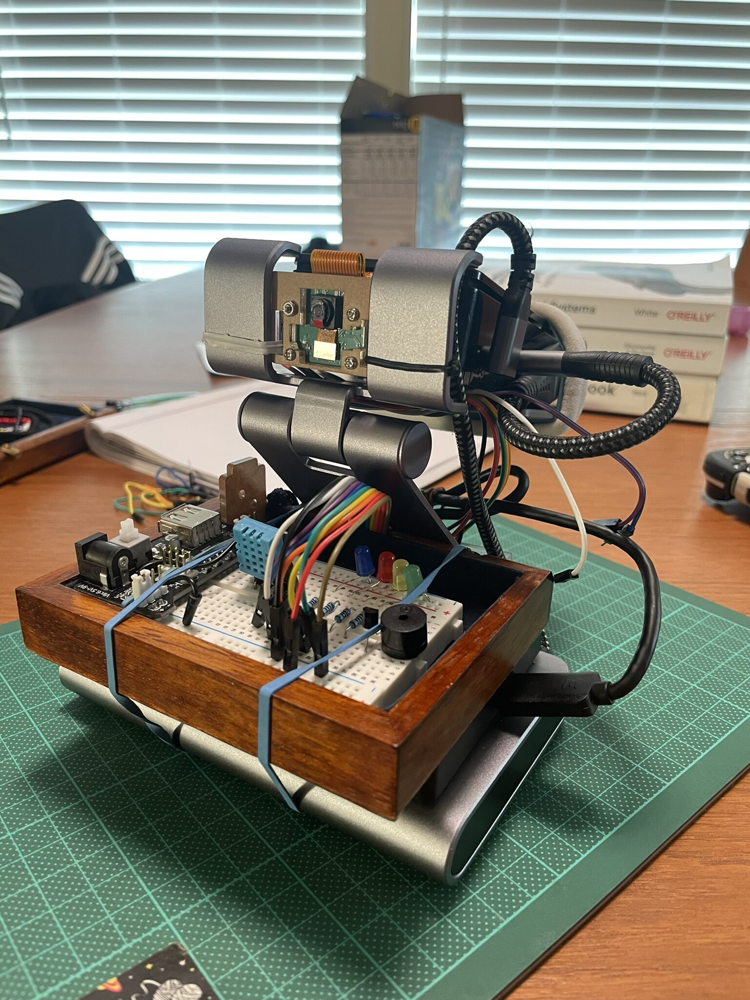
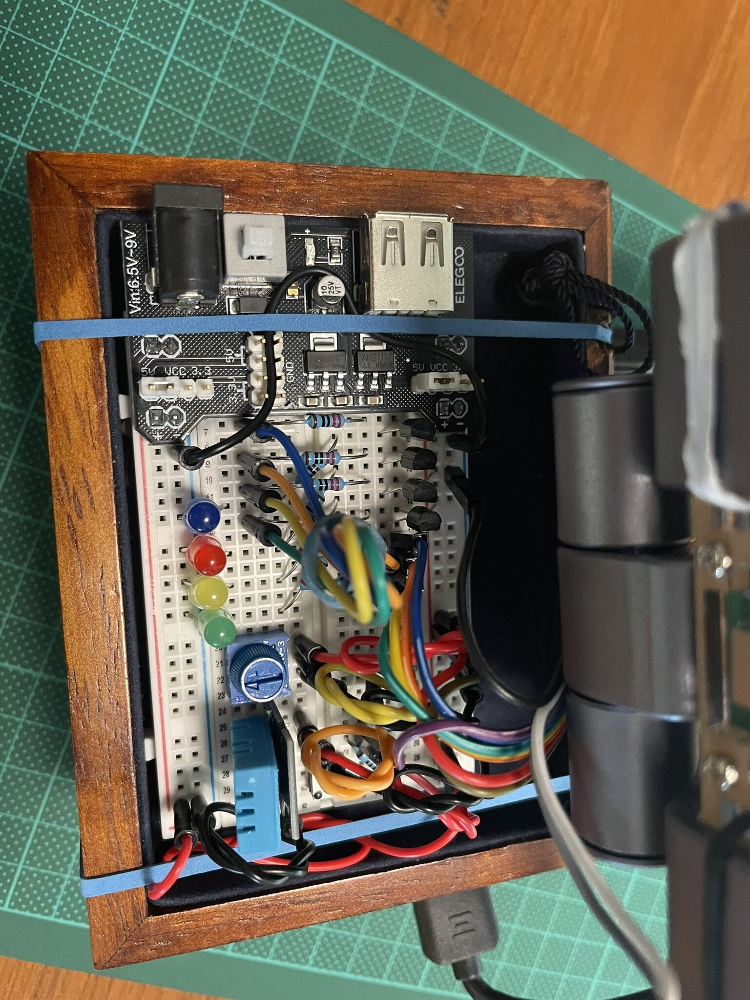
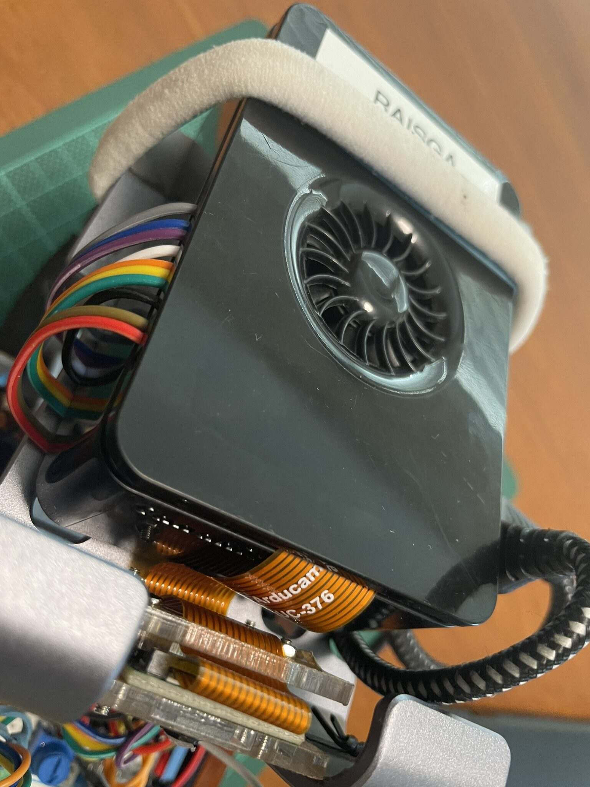
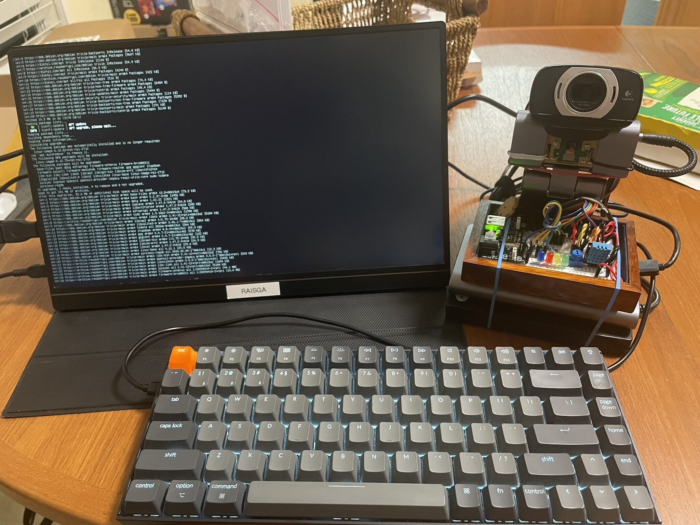
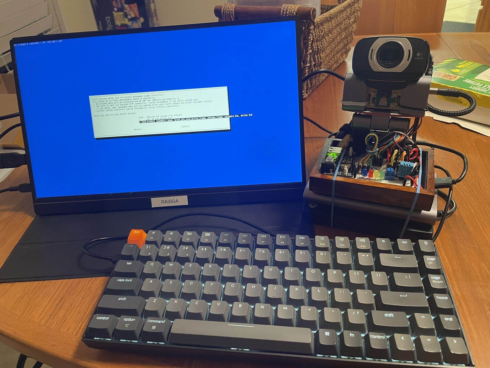
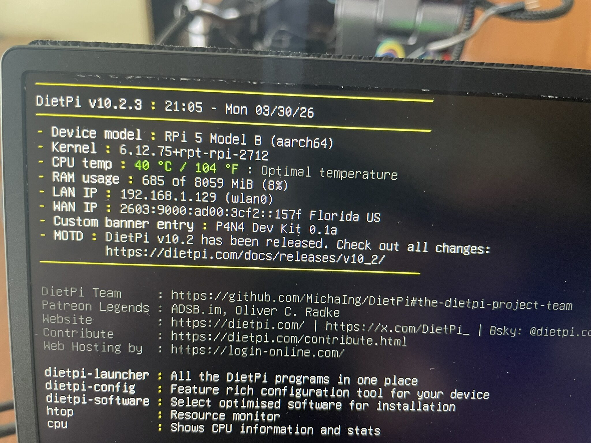
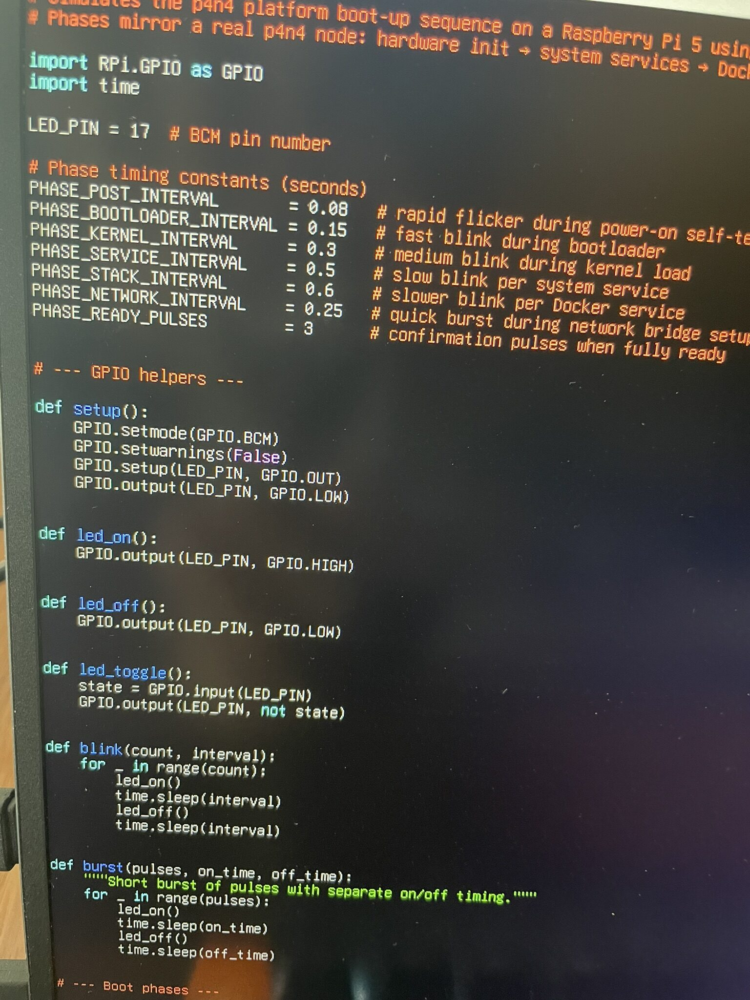
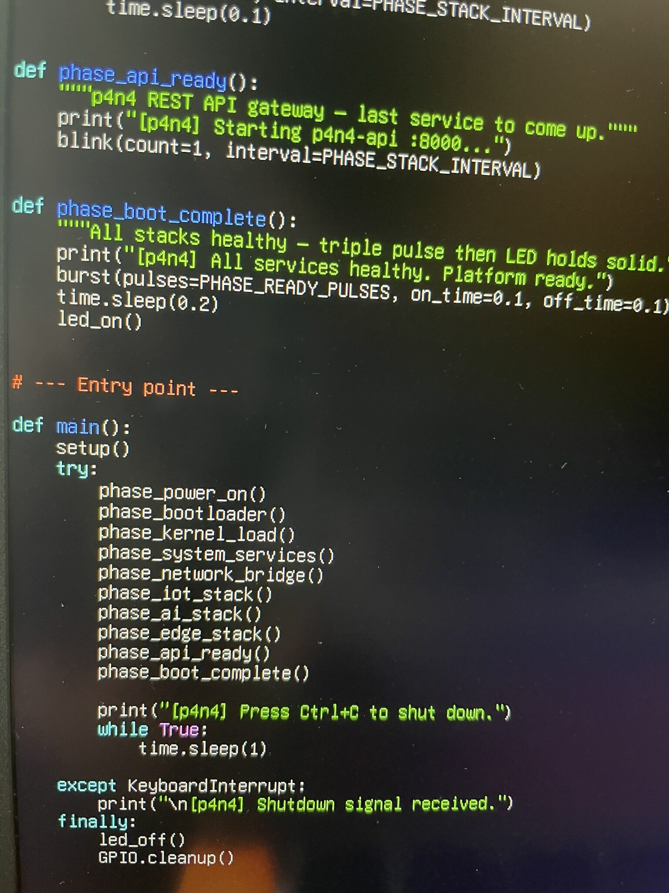
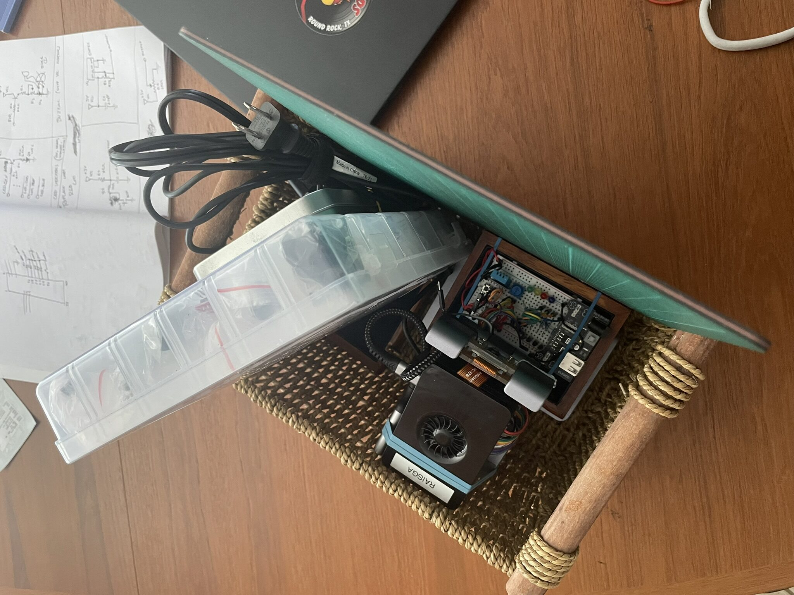

A few things needed addressing before moving forward. The prototype assembly was a bit rough, the OS choice was worth revisiting, and the first GPIO script was ready to run. This post will covered all three of them.

## A Cleaner Assembly

Before getting into software, the hardware got another pass.

The previous wiring was functional but messy. Cables running at odd angles, the breadboard not quite seated right. This round was about tightening it up: ribbon cable routed cleanly, power board seated properly, breadboard locked in.

Cleaner wiring makes debugging faster... When something stops working, you want to be able to see immediately whether it's a loose connection, not spend five minutes tracing cable runs.

## Using an Extra Camera

I connect another camera to the Pi, an old Logitech USB Webcam that my mom had around from an older computer. This is because I wanted to have more options to use when working with computer or artificial vision projects.

## Switching to DietPi

Raspberry Pi OS Lite was the obvious starting point, but for a platform that's going to run 24/7 with multiple Docker stacks, it carries more overhead than needed. DietPi is a stripped-down Debian-based image designed specifically for embedded and always-on use. Much lower baseline RAM usage, no unnecessary services running, and a fast automated install system for adding only what you actually need.

Flashed, booted, first screen.

DietPi's first-boot setup is interactive: it walks through locale, timezone, SSH configuration, and password setup before dropping you at a desktop. The `dietpi-software` tool handles everything else, there's no need to manually hunt down packages.

The welcome screen gives a quick system summary: CPU temp, memory usage, uptime. On a fresh install with nothing running, the Pi was sitting at around 8% RAM used. That's the kind of headroom you want when you're about to stack Docker containers on top.

## The Boot Simulation Script

With the OS sorted and Docker installed, the first `p4n4-hw` script was ready to run: `p4n4_boot_sim.py`. The idea is simple, a single LED on GPIO17 blinks through patterns that represent each possible startup phase of the p4n4 platform. Fast short pulses for POST, slower deliberate blinks for kernel loading, a burst pattern for network bridge configuration, one blink per service as each stack comes up. When everything is healthy, the LED goes solid.

The phases in order:

1. Power-on self-test (12 rapid blinks)
2. Bootloader init (6 blinks)
3. Kernel load and filesystem mount (8 blinks total)
4. System services: syslog, udev, i2c, spi, gpio-daemon, Docker (one blink each)
5. Network bridge configuration, `p4n4-net` at `172.20.0.0/16` (burst pattern)
6. IoT stack: Mosquitto, InfluxDB, Node-RED, Grafana (one blink each)
7. GenAI stack: Ollama, Letta, n8n (one blink each)
8. Edge AI stack: Edge Impulse runner (one blink)
9. p4n4-api (one blink)
10. Boot complete: three rapid pulses, then solid on

The script uses `RPi.GPIO` in BCM mode and a shared `p4n4_common` module that handles all the GPIO primitives: `blink`, `burst`, `fade_out`, `led_on`, `led_off`. The common module also has a TCP health probe function that checks each service's port... that one will matter more once the actual stacks are running.

Running `python3 p4n4_boot_sim.py` for the first time and watching the LED sequence play out was one of those moments that makes the whole project feel real. A blinking LED is not impressive on its own, but this one is narrating a platform startup. Each blink means something.

## Storage and Housing

With the Pi running cleanly and the first script confirmed, the assembled rig went into a basket for storage between sessions.

Not the most technical note, but keeping everything together in one place saves the ten minutes of hunting for cables and boards at the start of every session.

## What's Next

The boot simulation works. The OS is leaner and better suited to the platform. Next up is the health monitor script, `p4n4_health_monitor.py`, which runs on an interval and probes every service port in the stack. Red LED pattern for degraded, solid on for healthy. After that, the button handler and MQTT indicator scripts round out the GPIO layer... and then the GenAI stack comes up for real.

As the LED blinks, the platform breathes. :P
