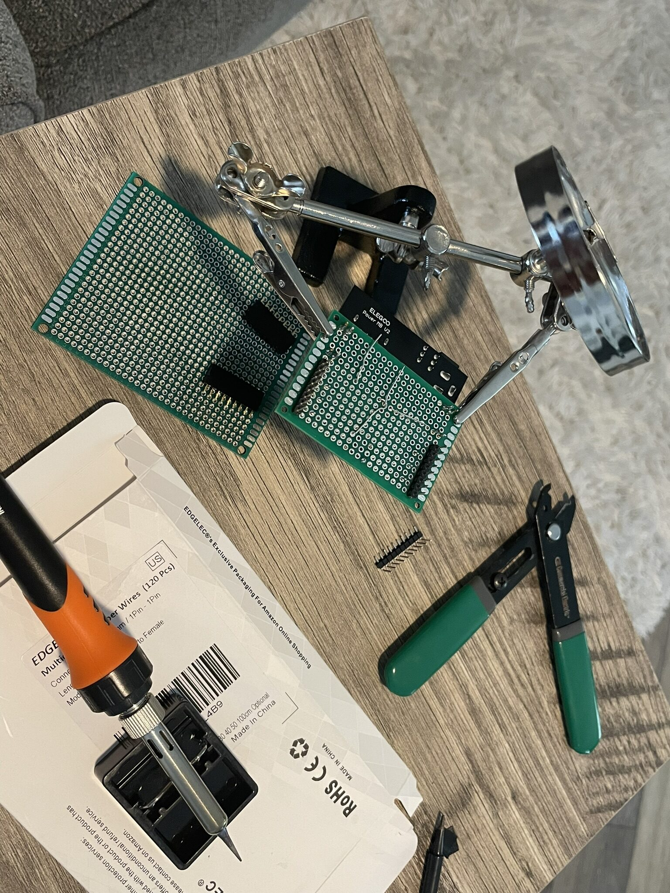
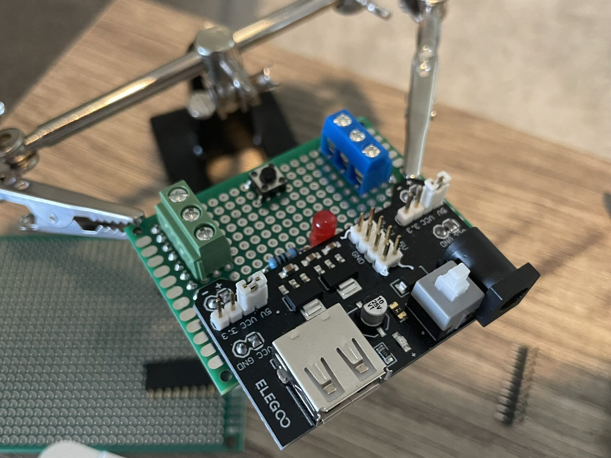
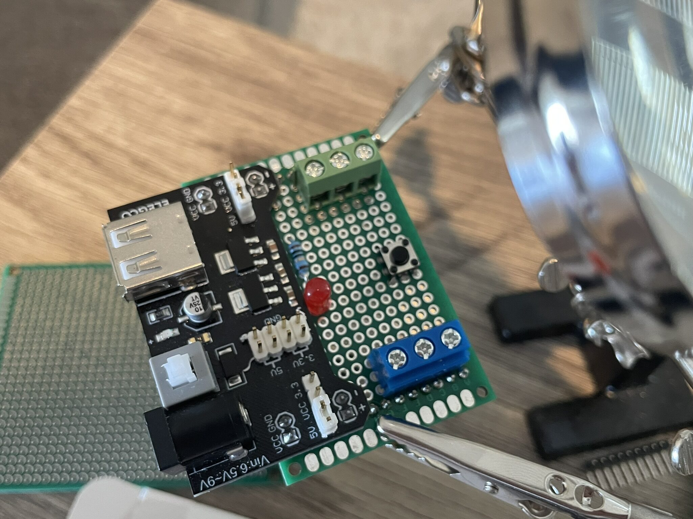
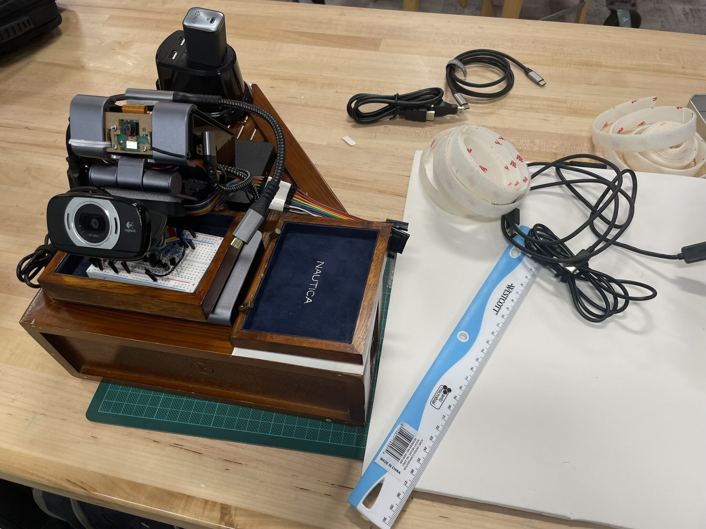

Scripts running, OS sorted, prototype confirmed. The next problem was physical: everything was still just components sitting on a desk.... This session was about fixing that. Designing what gets soldered onto the dev board, and building the wooden base that holds the whole platform together.

## Brainstorming the Protoboard

Before touching the soldering iron, time was spent on what actually belongs on the perfboard. The breadboard circuit works, but breadboards are not permanent. Every connection is one bump away from a false contact, and the platform is supposed to run unattended!

The goal was a clean, solderable version of the LED indicator circuit: a status LED, a button, passiev components like resistors, and header pins to be connected with the GPIO breakout. A KiCad schematic idea file already existed in `core/hw/prototypes/leds-indicator/` from an earlier design pass, but it wasn't finished. This session was to finish and to translate that that into physical solder joints on a perfboard.

The questions to work out: which components go on the perfboard now versus waiting for a proper PCB run, how to arrange the layout so the header pins align with the GPIO breakout, and whether the perfboard needs a mounting hole pattern that fits the wood base.

## The Wood Base

The bigger project for this session was the wood base itself. The platform needed a fixed, stable surface that everything mounts to: Pi 5, USB hard drive, power outlet, USB hub, cameras, perfboard, and GPIO communication board. A wooden panel gives physical structure without requiring custom metalwork.

The initial mount was about getting the layout right before committing to screw holes. Spacing matters here. The Pi's USB and Ethernet ports need to stay accessible, the hard drive needs airflow clearance, and the cable runs between components should be short and tidy.

Component placement settled on:

- **Raspberry Pi 5** at the center, GPIO header facing toward the GPIO breakout board
- **1TB USB hard drive** mounted to the side, cable running directly to a USB port
- **USB hub** underneath the Raspberry Pi, providing power supply and expansion ports for other peripherals
- **Cameras** positioned at the front edge, the USB camera angled for a clean field of view
- **Power outlet board** at the back, feeding the Pi, hub and everything else from a single cable in
- **GPIO communication board** alongside the Pi's header, ribbon cable kept short
- **Protoboard** with the LED indicator circuit, mounted adjacent to the GPIO board

## Perfboard Work

With the layout settled, the perfboard got its first real solder work.

The indicator circuit is straightforward: a single LED on GPIO17 with a 330-ohm resistor to ground. The header pin row lines up with the T-type GPIO breakout so the board seats directly without flying leads. Soldering on perfboard takes waaay longer than placing on a breadboard, but the results are solid. No connections shift under vibration, no pins pull out from handling...

The plan is still to move this to a proper PCB once the design is stable. The KiCad project in `dev-board/` is where that ends up. For now the perfboard is the right level of permanence: committed but adjustable if the design needs to change.

## The Complete Dev Board

With all the components positioned and the perfboard soldered, everything went onto the wood base.

The result is a self-contained unit. Everything in a fixed position, cable runs short and managed, all ports still accessible. Picking it up and setting it back down doesn't disturb a single connection. That's the actual goal: a platform that behaves consistently across sessions without a setup ritual at the start of each one.

## What's Next

The physical platform is done. The dev board is starting to take shape... a real thing now, not a pile of parts. The next sessions turn back to software: the remaining GPIO scripts (health monitor, button handler, MQTT indicator) and then the GenAI stack coming up for the first time (for real this time!).

The hardware work paid off. Everything that comes next builds on a stable base.
