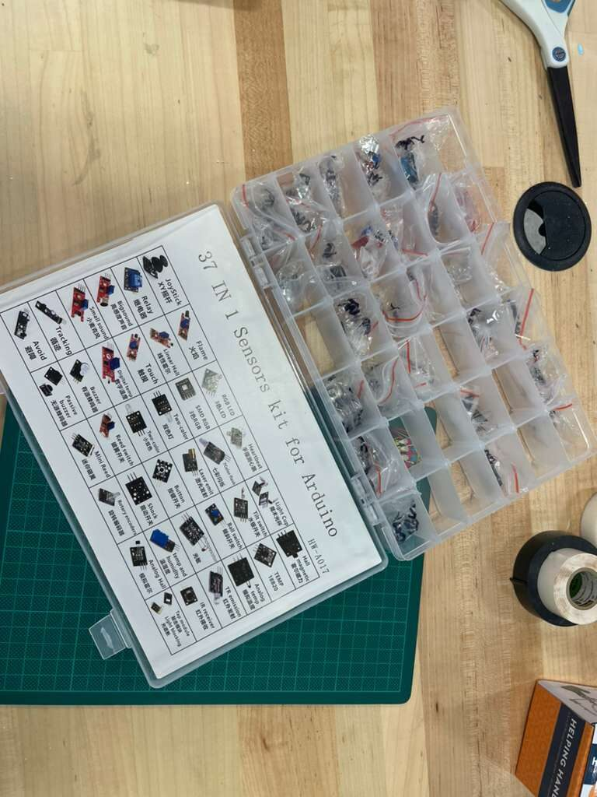
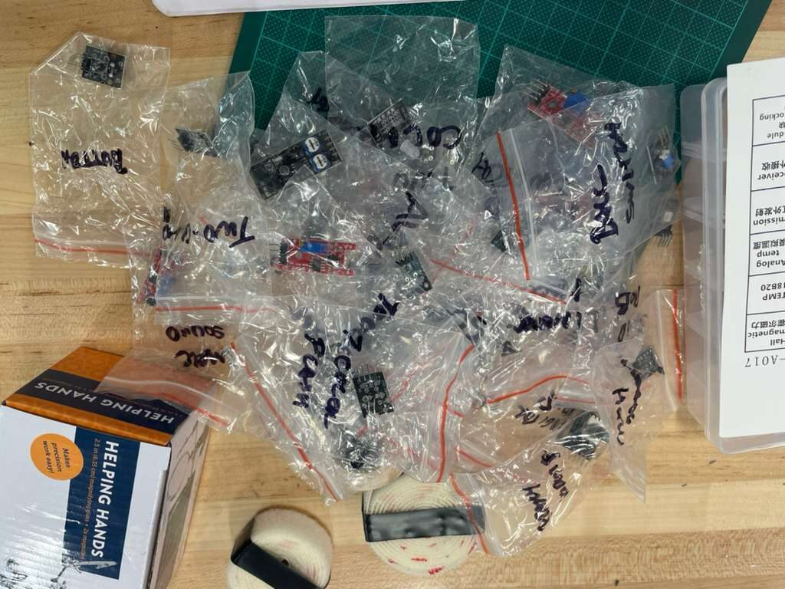
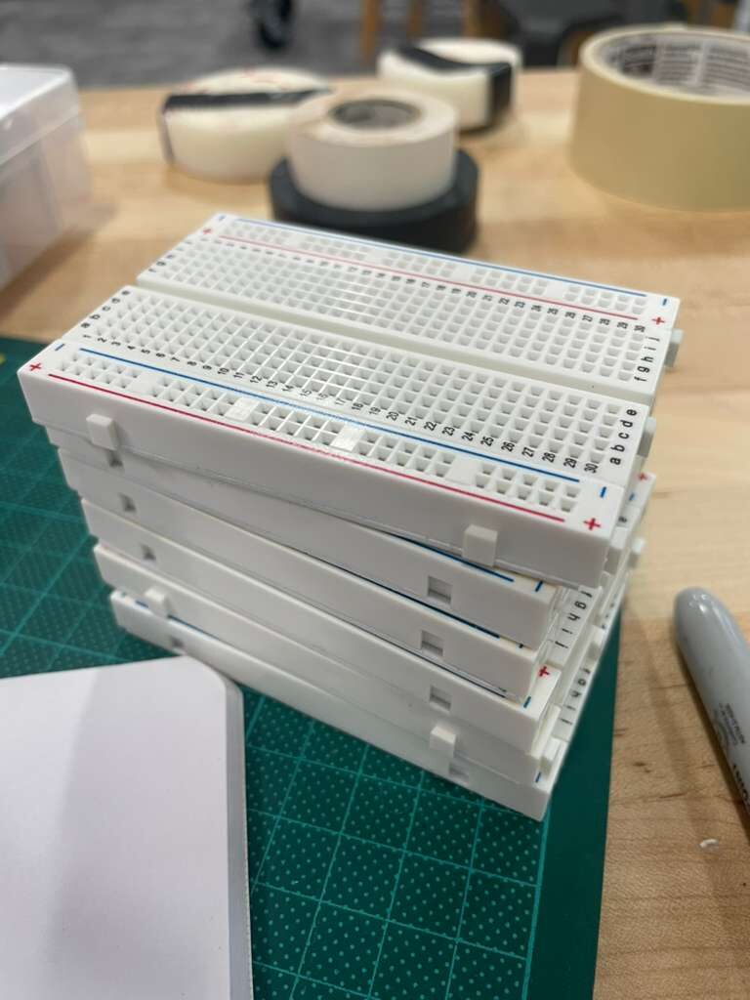
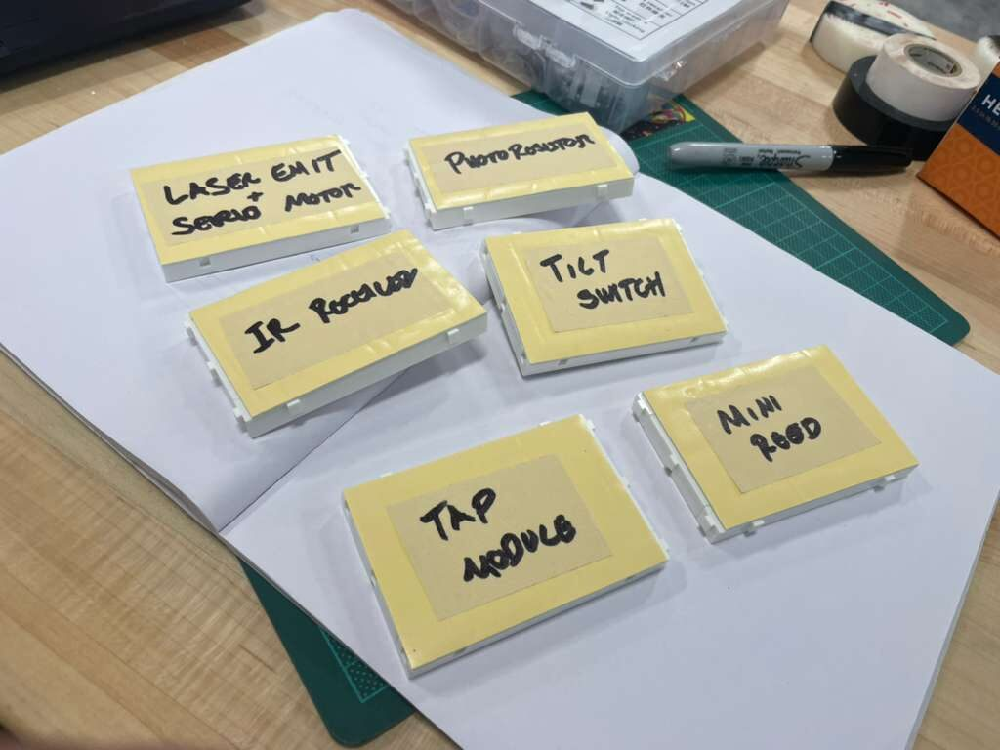
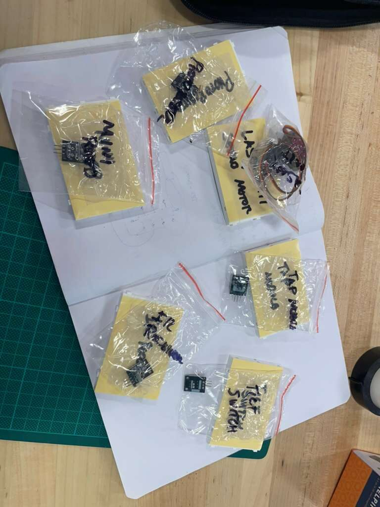
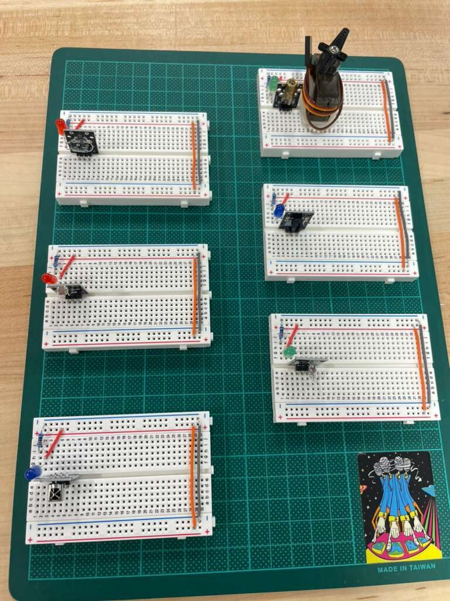

The dev board is built and the GPIO scripts are running. The platform has a solid base. Now it's time to add more things for it to actually sense.

This session was about expanding the sensor layer: six new modules, one breadboard each, and the circuit ideas to hook them all up to the Pi.

## The Sensor Set

The sensors were pulled from stock and organized before anything got wired.

Keeping sensors in labeled bags seems like overkill until you've spent twenty minutes hunting for the right module in a pile of similar-looking components. Each sensor got its own bag before anything else happened.

The six modules for this session:

- **Laser Emitter + Servo Motor** -- a laser diode on a servo, giving the platform a sweepable beam for presence detection or line-of-sight distance sensing. The servo connects to a PWM-capable GPIO pin; the laser emitter is a simple digital on/off.
- **Photoresistor** -- a light-dependent resistor for ambient light sensing. The Pi doesn't have a built-in ADC, so this will need a voltage divider into an MCP3008 or similar SPI ADC chip to produce a readable value.
- **Tilt Switch** -- a small ball-bearing tilt sensor that closes a circuit when tilted past a threshold. Reads as a digital GPIO input. Useful for tamper detection or orientation events.
- **IR Receiver** -- a TSOP-style infrared receiver that can decode signals from standard remote controls. Outputs a demodulated digital signal on a single GPIO pin.
- **Tap Module** -- a piezoelectric knock sensor. Detects physical impacts on a surface. Reads as a digital pulse on GPIO, no ADC needed.
- **Mini Reed Switch** -- a magnetically actuated switch. Closes when a magnet is nearby. Classic door or window sensor, or anything where you want to detect the presence of a magnet without contact.

Each of these will publish readings on a `sensors/` MQTT topic once they're wired and scripted. The Node-RED flow is already subscribed to `sensors/#`, so the pipeline is ready and waiting.

## Six Breadboards

Rather than crowding everything onto one board and creating a debugging nightmare, each sensor got its own dedicated breadboard.

One board, one sensor. Labels on each board match the labeled bags. This makes it easy to pick up a single circuit, work on it, and set it back down without disturbing anything else.

With the assignments settled, the sensors went onto their boards.

The photoresistor board is the most involved circuit of the six since it needs the ADC chip in the loop. The rest are straightforward: power, ground, signal to GPIO, pull-up or pull-down resistor where needed. The servo adds a PWM requirement, but the Pi 5 handles hardware PWM on several GPIO pins without needing an external driver.

## A Look at Two KiCad Tools

With six new breadboard circuits sketched out, the eventual path for all of them is onto proper PCBs. The KiCad project in `core/hw/dev-board/` is where that work lives. Two tools came up during research this session that are worth tracking.

The first is [kicad-happy](https://github.com/aklofas/kicad-happy), a curated KiCad component library. Having reliable symbols and footprints for common modules like the ones used here saves the time of sourcing or drawing them from scratch. For sensors that are off the shelf and widely used, a shared library like this is a practical shortcut.

The second is [KiCAD-MCP-Server](https://github.com/mixelpixx/KiCAD-MCP-Server), an MCP server that exposes KiCad operations to AI tools. This one is interesting in the context of p4n4 specifically. The project is already running a local LLM stack with Ollama, so the idea of connecting that to the PCB design workflow is a natural fit. An AI assistant that can query the schematic, suggest component placements, or validate netlist connections locally, without sending design files to an external service, is exactly the kind of tool the platform is built to support.

Neither tool gets integrated this session. But they're on the list.

## What's Next

Six circuits are sketched and six sensors are on their boards. The next step is writing the GPIO scripts for each one: reading values, publishing over MQTT, and watching the data land in InfluxDB. The photoresistor and servo circuits have the most complexity; the reed switch and tilt sensor can probably be done in an afternoon.

After the sensor scripts are solid, the GenAI stack comes up: Ollama, Letta, and n8n joining the network. That's the session where the AI layer stops being a diagram and starts being a process.

More sensors. More data. More to work with.
