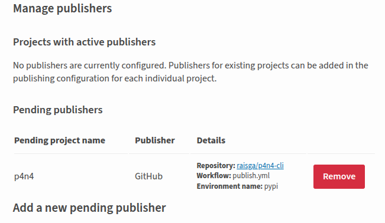

Hardware is stable, sensors are on their boards, and the dev board is a proper unit. This session stepped away from all of that and focused on the CLI: getting `p4n4` onto PyPI so anyone can install it with one command.

## What the CLI Does

The `p4n4` package is the entrypoint for the whole platform. It scaffolds new projects, manages stack lifecycle, and wires together the Docker Compose configuration for the IoT, GenAI, and Edge AI stacks. Built on Typer and Rich, so the interface is typed, tab-completable, and has decent output formatting out of the box.

The commands registered in this release:

| Command | What it does |
|---|---|
| `p4n4 init` | Scaffold a new p4n4 project |
| `p4n4 add` | Add a stack or component to an existing project |
| `p4n4 remove` | Remove a stack or component |
| `p4n4 up` | Bring the platform up (wraps Compose) |
| `p4n4 down` | Tear the platform down |
| `p4n4 status` | Show running service status |
| `p4n4 logs` | Tail service logs |
| `p4n4 secret` | Manage project secrets |
| `p4n4 validate` | Validate project configuration |
| `p4n4 upgrade` | Upgrade stack versions |
| `p4n4 ei` | Edge Impulse subcommands |
| `p4n4 template` | Template management subcommands |

Version `0.0.1`. Alpha, but functional, and now installable.

## Tagging and the Publish Workflow

The publish pipeline is a two-job GitHub Actions workflow that fires on release publication, not on every push. The flow:

1. A release is created and published on GitHub, tagged `v0.0.1`
2. The `build` job checks out the repo, installs `build`, and runs `python -m build` to produce the sdist and wheel under `dist/`
3. The artifact is uploaded between jobs
4. The `publish` job downloads the artifact and pushes it to PyPI via `pypa/gh-action-pypi-publish`

The publish job uses OIDC trusted publishing: no PyPI API token stored anywhere as a repository secret. Instead, the job declares `environment: pypi` and requests `id-token: write` permissions. GitHub's OIDC provider mints a short-lived token at runtime that PyPI verifies directly. One fewer credential to rotate, one fewer thing that can leak.

The build backend is `hatchling`, configured in `pyproject.toml`. Hatchling is straightforward to reason about: the wheel packages exactly the files listed in `[tool.hatch.build.targets.wheel]`, nothing implicit. The sdist excludes the test project directory and `.github/` folder via the sdist target config.

CI runs separately on every push to `main` and on pull requests: `ruff check` and `ruff format --check` for linting, then `pytest` across a matrix of Python 3.11, 3.12, and 3.13. The publish workflow only runs once CI is green and a release is explicitly tagged.

## Published



The package landed on PyPI cleanly on the first run. Trusted publishing worked without issues. The GitHub Actions log showed both jobs green, the release page linked to the PyPI index automatically.

Then the obvious test: install it from scratch in a clean environment.

```bash
pip install p4n4
p4n4 --version
```

```
p4n4 version 0.0.1
```

That's the moment that matters. Not the workflow passing, not the PyPI page loading... the CLI running from a package that anyone else can now install the same way.

## Some Observations

A few things worth noting about the publish process for next time:

**Trusted publishing is worth setting up properly.** The one-time configuration on PyPI's side (linking the GitHub repo and workflow file name) takes a few minutes, but the result is a cleaner security posture than rotating API tokens. PyPI's documentation for this has gotten a lot better.

**Tag before releasing.** The workflow triggers on release publication, but the release needs a tag to exist first. Creating the release and the tag at the same time in the GitHub UI works fine, but if the tag is missing the workflow will fail silently at checkout. Worth knowing.

**`python -m build` produces both sdist and wheel by default.** Both get uploaded. For a pure-Python package like this, both are useful: the wheel for fast installs, the sdist for environments that want to build from source or inspect the code.

**The `dev` extras keep the publish workflow clean.** Test and lint dependencies are under `[project.optional-dependencies] dev`, so the published package only pulls in the five runtime dependencies. No pytest, no ruff, no coverage tooling landing in production installs.

## What's Next

v0.0.1 is out. The CLI is on PyPI and installable. The next priorities are back on the hardware side: writing the GPIO read scripts for the six sensor circuits, then finally bringing up the GenAI stack for real. Ollama, Letta, and n8n have been in the architecture diagram since the beginning. Time to run them.

The version number starts at zero. There's a lot left to build.
